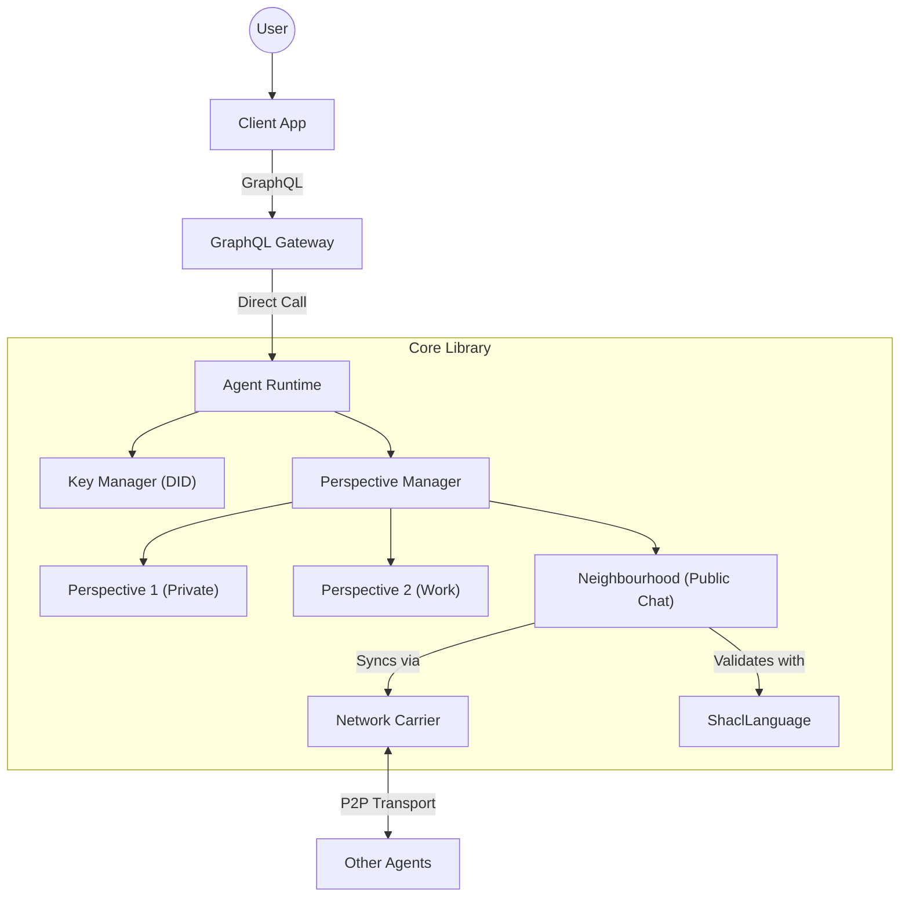
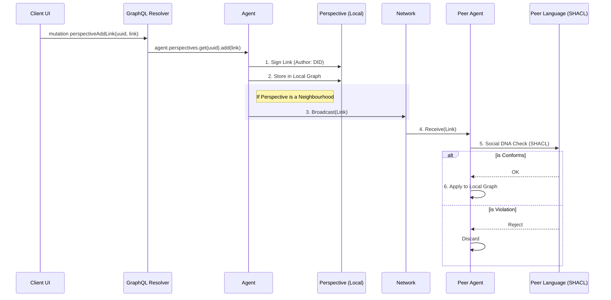

# Comprehensive Architecture

This document details how the AD4M (Agent-Centric Distributed Application Meta-Ontology) architecture is implemented in this repository using strictly W3C standards.

## 1. High-Level System Overview

The system allows an **Agent** to manage multiple **Perspectives** (local knowledge graphs). Some of these Perspectives are **Neighbourhoods** (shared graphs synchronized over a network).



## 2. Core Concepts & Mapping

| AD4M Concept | W3C Standard / Tech | Implementation Details |
| :-- | :-- | :-- |
| **Agent** | [DID](https://www.w3.org/TR/did-core/) | Identified by `did:key`. Signs all operations. |
| **Perspective** | [RDF Dataset](https://www.w3.org/TR/rdf11-datasets/) | A named graph in an `Oxigraph` or `N3` store. |
| **Link** | [RDF Triple](https://www.w3.org/TR/rdf11-concepts/) | Extended triple: `(Source, Predicate, Target) + Metadata`. |
| **Social DNA / Subject Class** | [SHACL](https://www.w3.org/TR/shacl/) + [SPARQL](https://www.w3.org/TR/sparql11-query/) | Defines the "Shape" and validation logic of allowed links (Social DNA). |
| **Expression** | [Verifiable Credential](https://www.w3.org/TR/vc-data-model/) | A signed data payload referenced by a Link. |

## 3. Data Flow: The "Link" Lifecycle

When a user sends a message in the Chat app, the following pipeline executes:



## 4. Component Deep Dive

### 4.1. The Agent (`packages/core/src/agent`)

The `Agent` class is the entry point. It holds the `KeyManager` and orchestrates the `Perspective` lifecycle.

- **KeyManager**: Generates `Ed25519` keypairs and handles `did:key` resolution.
- **PerspectiveManager**: A factory for creating/loading isolated graph databases.

### 4.2. Perspectives & Storage (`packages/core/src/ad4m`)

A `Perspective` is a wrapper around a SPARQL-compliant query engine.

- **Storage**: Currently using `Oxigraph` (or `N3` in-memory).
- **Isolation**: Each Perspective has a unique UUID. Queries are scoped to _only_ that UUID's graph.
- **Link Format**:
  ```typescript
  interface Link {
    source: string // URI
    predicate: string // URI
    target: string // URI or Literal
    author: string // DID
    timestamp: string // ISO String
    proof: object // Signature/VC
  }
  ```

### 4.3. Neighbourhoods & Languages (`packages/core/src/network`)

A `Neighbourhood` extends a `Perspective` by adding a Network layer and a "Language" (Social DNA).

- **Social DNA via SHACL**: In AD4M, "Languages" typically refer to Expression Languages. However, for defining the rules of a Neighbourhood (Subject Classes), we map this concept to **SHACL** combined with **SPARQL**.
  - **Subject Classes**: SHACL shapes define the structure of data (e.g., "A Message must have text").
  - **Validation**: The `ShaclLanguage` class acts as the executor of this Social DNA, modifying or rejecting incoming links based on conformance to the SHACL shapes.
- **Carrier**: An interface for transport.
  - `MockCarrier`: In-memory event bus.
  - `FileCarrier`: Uses a shared JSON file for local inter-process communication (IPC).
  - _(Future)_ `Libp2pCarrier`: True P2P networking.

We use `rdf-validate-shacl` to implement **Social DNA**. Input data (Links) is converted to an RDF Dataset. The validator checks if this dataset conforms to the **Subject Classes** defined in SHACL. If `conforms: false`, the Link is rejected, effectively enforcing the rules of the Neighbourhood.

Example Subject Class (Chat Message`, the Link is rejected by the peer.

Example Shape (Chat):

```ttl
@prefix sh: <http://www.w3.org/ns/shacl#> .
@prefix ad4m: <urn:ad4m:> .

ad4m:MessageShape
    a sh:NodeShape ;
    sh:targetClass ad4m:Message ;
    sh:property [
        sh:path ad4m:content ;
        sh:minCount 1 ;
        sh:datatype xsd:string ;
    ] .
```

## 5. Directory Structure Mapping

```
packages/core/
├── src/
│   ├── ad4m/           # Abstract AD4M implementation (Perspective, Neighbourhood)
│   ├── agent/          # Agent runtime & Factory
│   ├── identity/       # DID & Key Management
│   ├── models/         # RDF/VC Data Models
│   ├── network/        # P2P Transport adapters (Carrier)
│   ├── query/          # SPARQL Engine wrappers
│   └── validation/     # SHACL Validators
```
