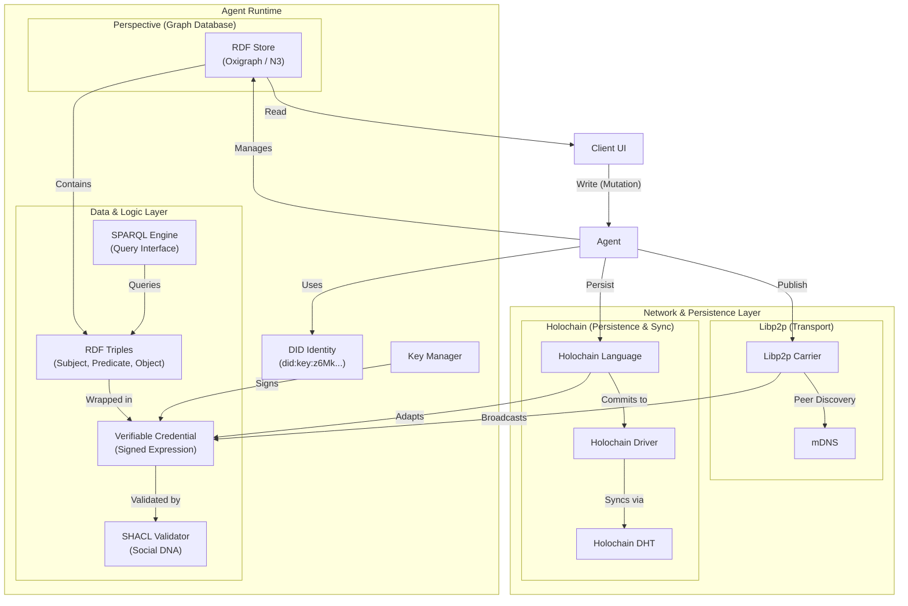

# AD4M Architecture: Technology Integration

This diagram illustrates how DIDs, RDF, VCs, SHACL, SPARQL, Libp2p, and Holochain are integrated within the AD4M stack.

## detailed Data Flow

### 1. Creation & Validation

1. **User** creates data (e.g. "Hello World").
2. **Agent** models this as **RDF** triples.
3. **KeyManager** wraps triples in a **VC** and signs it with the **DID**.
4. **SHACL** engine checks if the RDF structure matches the **Social DNA** of the implementation.

### 2. Storage & Query

1. Authenticated data is stored in the local **RDF Store** (Oxigraph).
2. UI components fetch data using **SPARQL** queries.

### 3. Distribution

- **Ephemeral/Real-time**: The **Libp2pCarrier** broadcasts the signed VC to connected peers.
- **Resilient Storage**: The **HolochainLanguage** adapter takes the VC, converts it to a Holochain commit, and pushes it to the **Holochain DHT** for persistence and redundancy.
